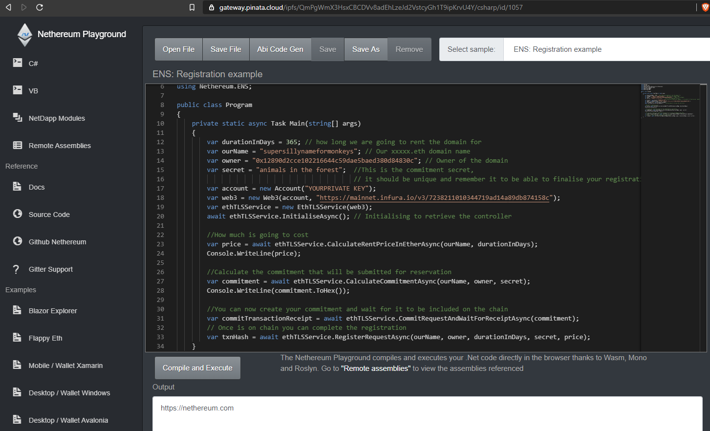
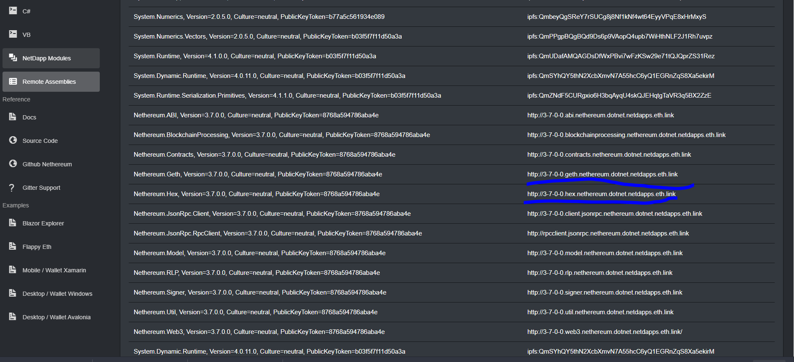

# Nethereum Playground

* Interact with Ethereum and learn how to use Nethereum directly in your browser
* Integrated Monaco editor, supporting rich IDE features like highlighting, code completion, method information<
* The compilation and execution of code does not leave your browser thanks to Mono Wasm and Roslyn
* Ever growing collection of samples in both C# and Vb.Net to learn Nethereum and Ethereum
* Load and save samples to and from the browser local storage or as a file

**You can run it here: http://playground.nethereum.com/** 

# Credits

* @Suchiman for creating Blazor Runny the first Wasm / Blazor / Roslyn compiler (that I know of and which this is based on) and to provide support for async https://github.com/Suchiman/Runny (Amazing!)
* Blazor Monaco for creating the Monaco embedded component, which this is also based on.
https://github.com/davidnmbond/BlazorComponents.Monaco
* @Enigmatic for adding the VB.Net support
* Blazor, Mono, Monaco and Roslyn teams 

