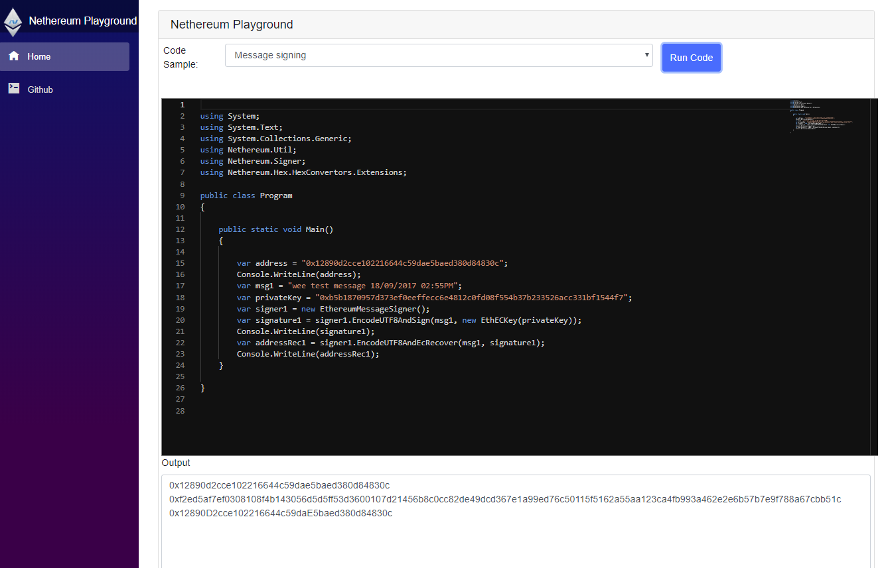

# Nethereum Playground

Compile and run Nethereum snippets or create your own using the Blazor / Monaco / Roslyn code editor and compiler.

You can run it here: http://playground.nethereum.com/

# Credits

* @Suchiman for creating Blazor Runny the first Wasm / Blazor / Roslyn compiler (that I know of and which this is based on) and to provide support for async https://github.com/Suchiman/Runny (Amazing!)
* Blazor Monaco for creating the Monaco embedded component, which this is also based on.
https://github.com/davidnmbond/BlazorComponents.Monaco
* @Enigmatic for adding the VB.Net support
* Blazor, Mono, Monaco and Roslyn teams 

